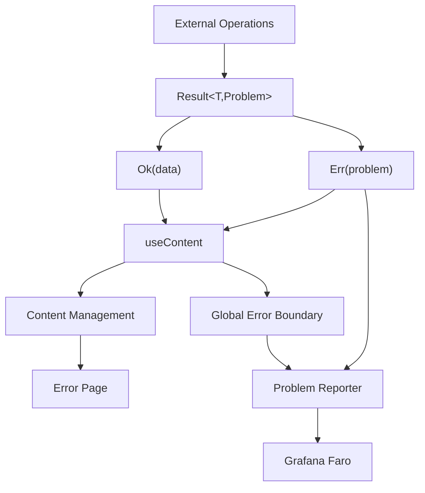

# CLAUDE.md

This file provides guidance to Claude Code when working with this repository.

## 🚨 CRITICAL: Use Existing Stack Only

**Never use conventional tools. Always use this project's stack:**

- **Package manager**: `bun` (never npm, yarn, pnpm)
- **Task runner**: `pls` (never npm scripts, make, etc.)
- **UI components**: `shadcn/ui` (never roll your own, never other libraries)
- **Styling**: Tailwind CSS (never custom CSS, other frameworks)
- **Architecture patterns**: Follow existing patterns in this codebase

## 📚 Required Reading Before Any Changes

**ALWAYS read documentation in this order:**

1. **Use Context7 MCP** to get latest docs for any library/framework
2. **Read relevant developer docs** from `/docs/developer/`:
   - [Monads.md](./docs/developer/Monads.md) - Result/Option system (REQUIRED)
   - [ProblemDetails.md](./docs/developer/ProblemDetails.md) - Error structure (REQUIRED)
   - [ErrorHandling.md](./docs/developer/ErrorHandling.md) - Comprehensive error system
   - [Auth.md](./docs/developer/Auth.md) - Authentication with Logto
   - [ApiClients.md](./docs/developer/ApiClients.md) - Server-side API patterns
   - [Configuration.md](./docs/developer/Configuration.md) - Config management
   - [ContentManager.md](./docs/developer/ContentManager.md) - UI state management
   - [DependencyInjection.md](./docs/developer/DependencyInjection.md) - Provider system
   - [UrlState.md](./docs/developer/UrlState.md) - URL synchronization
   - [Faro.md](./docs/developer/Faro.md) - Observability
   - [LottieAnimations.md](./docs/developer/LottieAnimations.md) - Animations

## Project Architecture

**Stack**: Next.js 15 (Pages Router) + TypeScript + Tailwind + shadcn/ui + Cloudflare Workers
**Runtime**: Bun package manager with `pls` task runner

### Core Systems

- **Error Handling**: Result monads + Problem Details (RFC 7807) + automatic Faro reporting
- **Authentication**: Logto-based with discriminated unions, SSR/CSR support, automatic token refresh
- **Content Management**: Global vs Free content managers for loading/empty/error states
- **API Clients**: Server-side only via `withServerSideAtomi` pattern, return Result monads
- **Configuration**: Landscape-specific (lapras/pichu/pikachu/raichu) with environment overrides
- **URL State**: Smart synchronization with debouncing and validation
- **Observability**: Automatic Grafana Faro integration

## Essential Commands

```bash
# Development
pls dev           # Start Next.js dev server
pls preview       # Build + run with Cloudflare Workers

# Code Quality (ALWAYS RUN BEFORE CHANGES)
pls lint          # Pre-commit hooks (biome, TypeScript, formatting)

# Build & Deploy
pls build         # Build with OpenNext for Cloudflare
pls deploy -- <env>  # Deploy to landscape

# SDK Generation
pls generate:sdk  # Generate all API clients from OpenAPI specs
```

## Core Patterns (FOLLOW THESE)

### 1. Error Handling (MANDATORY)

```typescript
// ✅ Always use Result monads
import { Ok, Err, type Result } from '@/lib/monads/result';
import type { Problem } from '@/lib/problem/core/types';

// API calls return Results
const result = await apiTree.alcohol.zinc.vUserList({ version: '1.0' });

result.match({
  ok: users => setUsers(users),
  err: problem => {
    // Automatic error reporting via ProblemReporter
    problemReporter.pushError(problem, {
      source: 'user-action',
      context: { action: 'load-users' },
    });
  },
});

// ❌ NEVER use try-catch for internal code
// ❌ NEVER throw exceptions
// ❌ NEVER use null/undefined - use Option<T>
```

### 2. API Clients (Server-Side Only)

```typescript
// ✅ Server-side API access
import { withServerSideAtomi } from '@/adapters/atomi/next';
import { buildTime } from '@/adapters/external/core';

export const getServerSideProps = withServerSideAtomi(buildTime, async (context, { apiTree }) => {
  const result = await apiTree.alcohol.zinc.vUserList({ version: '1.0' });

  return result.match({
    ok: users => ({ props: { users } }),
    err: problem => ({ props: { error: problem } }),
  });
});

// ❌ NEVER use client-side API calls
// ❌ NEVER use fetch() directly in components
```

### 3. Content Management

```typescript
// ✅ Global content system (full page states)
const content = useContent(result, {
  notFound: 'No users found',
  // No custom loader/empty = uses global page states
});

// ✅ Free content system (component-level states)
const [loading, loader] = useFreeLoader();
const [desc, empty] = useFreeEmpty();

const content = useContent(result, {
  notFound: 'No users found',
  loader,  // Prevents global page loading
  empty,   // Prevents global page empty state
});

return (
  <FreeContentManager
    LoadingComponent={() => <div>Loading...</div>}
    EmptyComponent={({ desc }) => <div>{desc}</div>}
    loadingState={loading}
    emptyState={desc}
  >
    {content}
  </FreeContentManager>
);
```

### 4. Configuration

```typescript
// ✅ Access configuration
import { useConfig } from '@/lib/config';

const { common, client } = useConfig();
const appName = common.app.name;
const faroEnabled = client.faro.enabled;
```

### 5. UI Components

```typescript
// ✅ Always use shadcn/ui components
import { Button } from '@/components/ui/button';
import { Card } from '@/components/ui/card';
import { Input } from '@/components/ui/input';

// ✅ Use existing Lottie presets
import { LoadingLottie, SuccessLottie } from '@/components/lottie';

// ❌ NEVER create custom UI components when shadcn exists
// ❌ NEVER use other UI libraries
```

### 6. Authentication

```typescript
// ✅ Check authentication state
import { useClaims } from '@/lib/auth/providers';

const [result, content] = useClaims();
if (result === 'err') return <AuthError />;

const [hasData, authState] = content;
if (!hasData) return <Loading />;

authState.match({
  authed: ({ data: claims }) => <div>Welcome {claims.username}!</div>,
  unauthed: () => <button onClick={() => window.location.assign('/api/logto/sign-in')}>Sign In</button>,
});

// ✅ Protected server-side pages
export const getServerSideProps = withServerSideAtomi(buildTime, async (context, { auth }) => {
  const userState = await auth.getClaims();
  return userState.match({
    ok: state => state.match({
      authed: ({ data }) => ({ props: { user: data } }),
      unauthed: () => ({ redirect: { destination: '/api/logto/sign-in', permanent: false } }),
    }),
    err: problem => ({ props: { error: problem } }),
  });
});
```

### 7. URL State Management

```typescript
// ✅ Simple URL sync
const [query, setQuery] = useUrlState('q', '');

// ✅ Advanced search with auto-execute
const { query, setQuery, clearSearch } = useSearchState(
  { q: '', category: 'all' },
  async params => {
    const result = await searchAPI(params);
    setResults(result);
  },
  { debounceMs: 300 },
);
```

## File Structure & Conventions

```
src/
├── pages/           # Next.js Pages Router (SSR + API routes)
├── components/
│   ├── ui/         # shadcn/ui components ONLY
│   └── lottie/     # Lottie animation presets
├── adapters/        # Dependency injection system
├── clients/         # Generated API clients (server-side)
├── lib/
│   ├── monads/     # Result/Option system
│   ├── config/     # Configuration management
│   ├── content/    # Content state management
│   ├── urlstate/   # URL synchronization
│   └── observability/ # Faro integration
├── config/         # Configuration schemas (client/server/common)
├── problems/       # Problem Details definitions
└── types/          # TypeScript definitions
```

## Adding New Features

### 1. New API Client

```bash
# Add to Taskfile.yaml, then:
pls generate:sdk:platform:service

# Update src/adapters/external/core.ts clientTree
# Add URLs to config files (lapras.settings.yaml, etc.)
```

### 2. New Problem Type

```typescript
// Create src/problems/definitions/my-error.ts
export const myErrorDefinition: ZodProblemDefinition<typeof MyErrorSchema> = {
  id: 'my_error',
  title: 'MyError',
  status: 422,
  schema: MyErrorSchema,
  createDetail: context => `Error: ${context.reason}`,
};

// Add to src/problems/registry.ts
// Export from src/problems/index.ts
```

### 3. New Configuration

```typescript
// Update src/config/client/schema.ts or src/config/server/schema.ts
// Add to landscape files: pichu.settings.yaml, raichu.settings.yaml
// Access via useConfig()
```

## Critical Rules

### ✅ DO

- Use `pls` for all tasks (`pls dev`, `pls lint`, `pls build`)
- Use `bun` for package management
- Use shadcn/ui for ALL UI components
- Read Result monads and Problem Details docs FIRST
- Use Context7 MCP for latest library docs
- Follow existing patterns exactly
- Use server-side API patterns only
- Use appropriate content management system
- Run `pls lint` before any changes
- Convert external APIs to Result monads at boundaries

### ❌ DON'T

- Use npm, yarn, or pnpm (use `bun` only)
- Use npm scripts or make (use `pls` only)
- Create custom UI components (use shadcn/ui)
- Use try-catch for internal code (use Result monads)
- Use null/undefined (use Option<T>)
- Use client-side API calls (server-side only)
- Use conventional patterns from other projects
- Make changes without reading relevant docs
- Skip error handling or use throwing functions

## Dependency Injection

All services available through `AtomiProvider`:

```typescript
// Automatic setup in _app.tsx
<AtomiProvider>
  <YourApp />
</AtomiProvider>

// Access services anywhere:
import { useConfig } from '@/lib/config';
import { useProblemReporter } from '@/adapters/problem-reporter/providers';

const config = useConfig();
const problemReporter = useProblemReporter();
```

## Error System Architecture



## Landscapes (Environments)

- **lapras** - Local development
- **pichu** - Development environment
- **pikachu** - Staging environment
- **raichu** - Production environment

Configuration automatically loads per landscape with environment variable overrides.

## Build & Deploy

```bash
# Build for Cloudflare Workers
pls build

# Deploy to specific landscape
pls deploy pichu    # Development
pls deploy raichu   # Production
```

This codebase uses a sophisticated architecture with automatic error handling, observability, and state management. Always use existing patterns and tools rather than conventional approaches.
