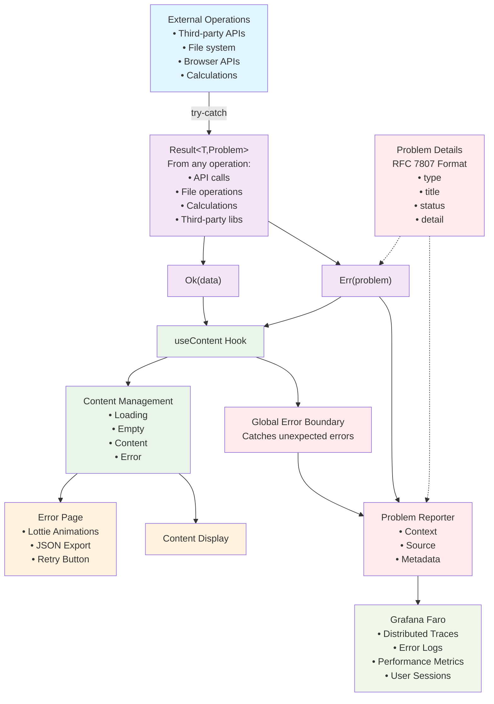

# Error Handling System

## Overview

Unified error handling system with automatic reporting, user-friendly error pages,
and observability integration.

Built on [Result monads](./Monads.md) and [Problem Details](./ProblemDetails.md) format (RFC 7807) - no try/catch needed.

## System Architecture



## How It Works

1. **External operations wrapped with try-catch** - Third-party APIs, file system, browser APIs, calculations converted to Result monads
2. **Result monads from any source** - Never throw exceptions, always Ok(data) or Err(problem)
3. **Content system handles all Results** - useContent extracts data and manages loading/empty/error states regardless of error source
4. **Automatic error reporting** - Problems from any operation automatically sent to Grafana Faro with context
5. **User-friendly error pages** - Status-specific Lottie animations, JSON export, retry functionality
6. **Global error boundaries** - Catch any unexpected errors that slip through the Result system

## Basic Usage

### Working with Result Monads

```typescript
import { useState } from 'react';
import { useContent } from '@/lib/content/providers';
import { useProblemReporter } from '@/adapters/problem-reporter/providers';
import { Ok, Err, type Result } from '@/lib/monads/result';
import type { Problem } from '@/lib/problem/core/types';

function MyComponent() {
  const [result, setResult] = useState<Result<User[], Problem>>(Ok([]));
  const problemReporter = useProblemReporter();

  // useContent automatically handles Result monads
  const content = useContent(result, {
    notFound: 'No users found',
    // No custom error handler = automatic global error handling
  });

  const handleLoad = async () => {
    // Example 1: API call (already returns Result)
    const apiResult = await apiTree.alcohol.zinc.vUserList({ version: '1.0' });

    // Example 2: External operation wrapped with try-catch
    const fileResult = await (async (): Promise<Result<string, Problem>> => {
      try {
        const data = await fetch('/external-api/data.json');
        const content = await data.text();
        return Ok(content);
      } catch (error) {
        const problem = problemRegistry.createProblem('network_error', {
          url: '/external-api/data.json',
          message: error.message,
        });
        return Err(problem);
      }
    })();

    // Both Results handled the same way
    const combinedResult = Res.all([apiResult, fileResult]).map(([users, fileData]) => ({
      users,
      fileData,
    }));

    combinedResult.match({
      ok: data => setResult(Ok(data.users)),
      err: problem => {
        // Optional: Manual error reporting with context
        problemReporter.pushError(problem, {
          source: 'user-action',
          context: { action: 'load-data', userId: user?.id },
        });

        // Set error result - triggers automatic error page
        setResult(Err(problem));
      },
    });
  };

  return (
    <div>
      <button onClick={handleLoad}>Load Users</button>
      {content?.map(user => <div key={user.id}>{user.name}</div>)}
    </div>
  );
}
```

### Server-Side Error Handling

```typescript
import { withServerSideAtomi } from '@/adapters/atomi/next';
import { buildTime } from '@/adapters/external/core';

// API routes - errors automatically converted to Problem format
export default withServerSideAtomi(buildTime, async (req, res, { apiTree, problemRegistry }) => {
  const result = await apiTree.alcohol.zinc.vUserList({ version: '1.0' });

  return result.match({
    ok: users => res.status(200).json(users),
    err: problem => res.status(problem.status).json(problem), // RFC 7807 format
  });
});

// getServerSideProps - errors become page props
export const getServerSideProps = withServerSideAtomi(buildTime, async (context, { apiTree }) => {
  const result = await apiTree.alcohol.zinc.vUserList({ version: '1.0' });

  return result.match({
    ok: users => ({ props: { users } }),
    err: problem => ({ props: { error: problem } }), // Error page automatically shown
  });
});
```

## Error Reporting

Error reporting happens automatically through the ProblemReporter system:

```typescript
import { useProblemReporter } from '@/adapters/problem-reporter/providers';

function MyComponent() {
  const problemReporter = useProblemReporter();

  const reportCustomError = () => {
    // Manual error reporting with rich context
    problemReporter.pushError(new Error('Something went wrong'), {
      source: 'user-interaction',
      context: {
        userId: user.id,
        action: 'file-upload',
        fileName: file.name,
        fileSize: file.size,
        timestamp: Date.now(),
      },
    });
  };

  return <button onClick={reportCustomError}>Report Error</button>;
}
```

### Error Sources

Use consistent source identifiers for better tracking:

```typescript
// ✅ Good - descriptive sources
problemReporter.pushError(error, { source: 'form-validation' });
problemReporter.pushError(error, { source: 'api-request' });
problemReporter.pushError(error, { source: 'file-upload' });
problemReporter.pushError(error, { source: 'user-checkout' });

// ❌ Avoid - generic sources
problemReporter.pushError(error, { source: 'error' });
```

## Error Page Features

Error pages are automatically displayed with:

- **Status-specific animations** - Different Lottie animations for 400, 404, 500, etc.
- **JSON export** - Users can copy error details for support
- **Refresh functionality** - Automatic retry mechanisms
- **Copy to clipboard** - Easy sharing of error information

### Manual Error Display

```typescript
import { useErrorContext } from '@/lib/content/providers';

function MyComponent() {
  const { setError } = useErrorContext();

  const triggerError = () => {
    // Manually trigger error page (see ProblemDetails.md for format)
    setError({
      type: 'custom_error',
      title: 'Operation Failed',
      status: 422,
      detail: 'The requested operation could not be completed.',
    });
  };

  return <button onClick={triggerError}>Trigger Error</button>;
}
```

## Error Recovery

```typescript
import { useErrorContext } from '@/lib/content/providers';

function MyComponent() {
  const { clearError } = useErrorContext();
  const [result, setResult] = useState(Ok([]));

  const handleRetry = async () => {
    clearError(); // Clear any existing error state

    // Retry the operation
    const newResult = await performOperation();
    setResult(newResult); // Updates useContent automatically
  };

  return <button onClick={handleRetry}>Retry</button>;
}
```

## Best Practices

### 1. Use Result Monads

```typescript
// ✅ Handle both cases with Result monads
result.match({
  ok: data => processData(data),
  err: problem => {
    problemReporter.pushError(problem, { source: 'data-processing' });
    // Error automatically handled by content system
  },
});

// ❌ Don't unwrap without handling errors
const data = result.unwrap(); // Throws if Result is Err!

// ✅ Safe unwrapping with defaults
const data = result.unwrapOr([]);
```

### 2. Let the System Handle Errors

```typescript
// ✅ Recommended - let global system handle errors
const content = useContent(result, {
  notFound: 'No data found',
  // No custom error handler = automatic global handling
});

// ❌ Only use custom error handling if absolutely necessary
const content = useContent(result, {
  error: error => {
    // This REPLACES global error handling - you must handle everything
    console.error('Custom handling:', error);
  },
});
```

### 3. Provide Rich Context

```typescript
// ✅ Rich context for debugging
problemReporter.pushError(error, {
  source: 'checkout-flow',
  context: {
    step: 'payment',
    paymentMethod: 'credit_card',
    amount: order.total,
    userId: user.id,
    orderItems: order.items.length,
  },
});

// ❌ Minimal context
problemReporter.pushError(error, { source: 'checkout' });
```

### 4. Use Appropriate Error Types

See [Problem Details documentation](./ProblemDetails.md) for creating properly structured errors:

```typescript
import { problemRegistry } from '@/problems';

// Create structured error with validation
const problem = problemRegistry.createProblem('validation_error', {
  field: 'email',
  constraint: 'Invalid email format',
});

// Use in Result
return Err(problem);
```

## Integration Points

- **Faro Observability**: Automatic error correlation with distributed tracing
- **Content System**: Automatic error page display through `useContent`
- **API Clients**: All clients return Result monads with Problem format
- **Global Boundaries**: React error boundaries catch unexpected errors

The error handling system is designed to work automatically - just use Result monads and let the system handle error reporting, user display, and observability.
